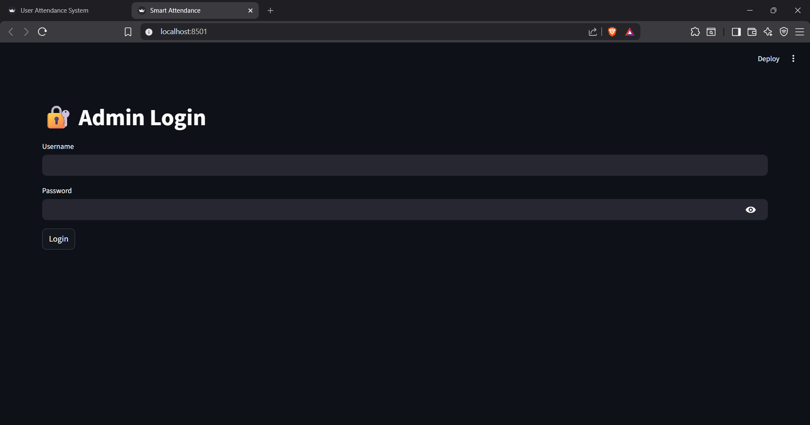
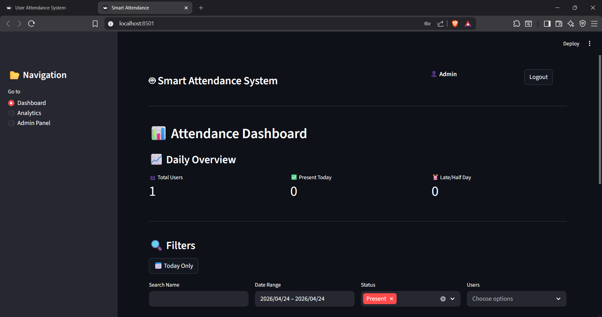
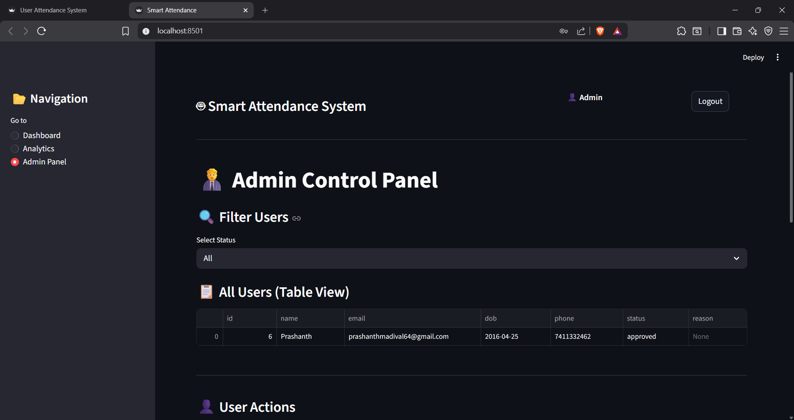
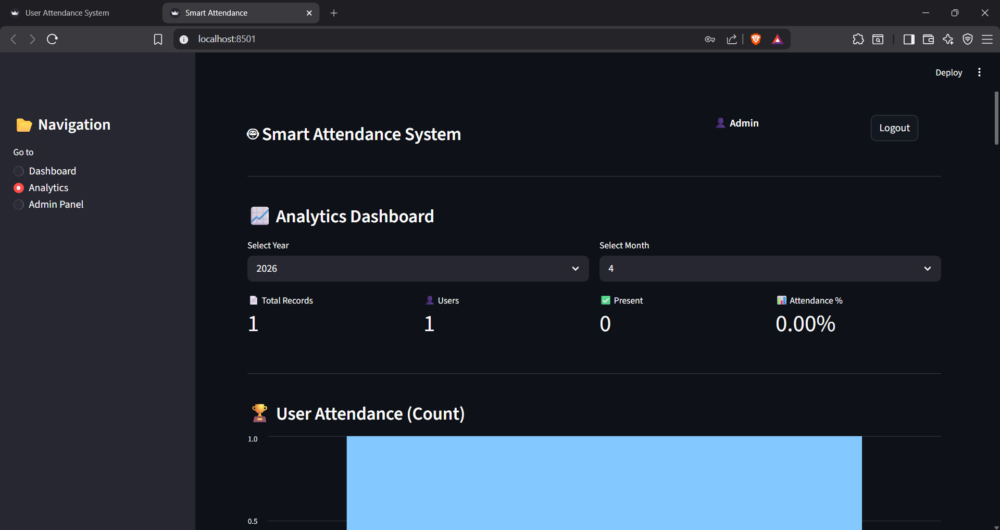
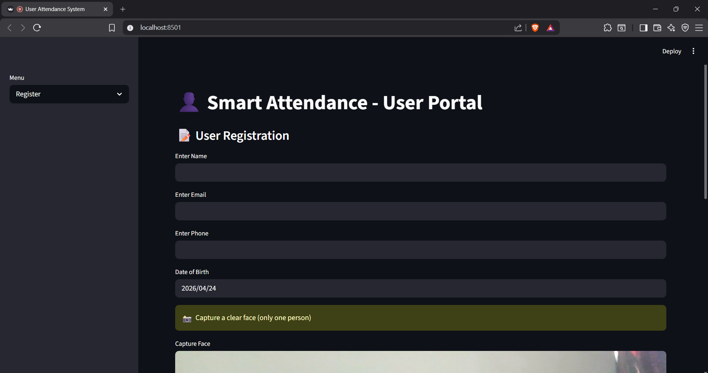
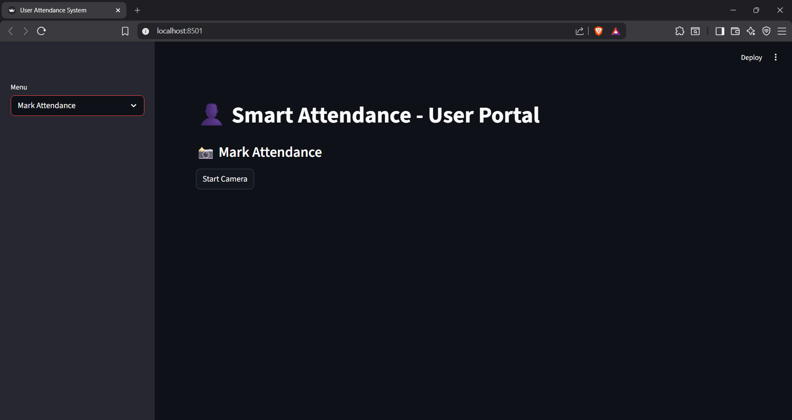
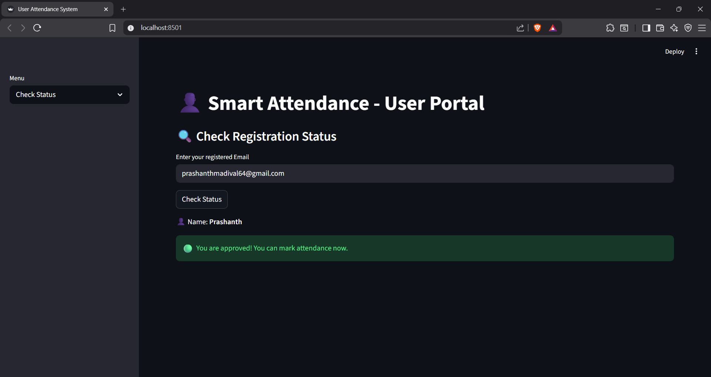

# 👁️ AI Face Recognition Attendance System

An intelligent attendance system that uses **Face Recognition (YOLOv8 + FaceNet)** to automatically detect and mark attendance in real time.

---

## 🚀 Overview

This project eliminates manual attendance by using **computer vision and deep learning**.
Users register with their face, admins approve them, and attendance is marked automatically using real-time face recognition.

---

## ✨ Key Features

### 👤 User Portal

* Register with personal details and face capture
* Check approval status (Pending / Approved / Rejected)
* Mark attendance using webcam
* Automatic check-in and check-out system

### 🛠️ Admin Panel

* Secure admin login
* Approve / reject users
* View attendance records
* Dashboard with analytics
* Email notifications

### 🤖 AI & Computer Vision

* Face detection using **YOLOv8**
* Face recognition using **FaceNet embeddings**
* Multi-frame embedding averaging for better accuracy

---

## 🧠 Tech Stack

| Category        | Technology                |
| --------------- | ------------------------- |
| Frontend        | Streamlit                 |
| Backend         | Python                    |
| Database        | SQL Server (pyodbc)       |
| Computer Vision | OpenCV, YOLOv8            |
| Deep Learning   | FaceNet (facenet-pytorch) |
| Data Processing | NumPy, Pandas             |

---

## 📂 Project Structure

```id="structure1"
AI-Face-Recognition-Attendance-System/
│
├── admin_app/        # Admin panel (approval, analytics, dashboard)
├── user_app/         # User portal (registration, attendance)
│
├── screenshots/      # Project screenshots
├── .gitignore
└── README.md
```

---

## ⚙️ Setup Instructions

### 1️⃣ Clone Repository

```id="clonecmd"
git clone https://github.com/maniac-24/AI-Face-Recognition-Attendance-System.git
cd AI-Face-Recognition-Attendance-System
```

---

### 2️⃣ Install Dependencies

#### Admin App

```id="admininstall"
cd admin_app
pip install -r requirements.txt
```

#### User App

```id="userinstall"
cd ../user_app
pip install -r requirements.txt
```

---

### 3️⃣ Configure Secrets

Create file:

```
.streamlit/secrets.toml
```

```id="secretsexample"
[email]
sender = "your_email@gmail.com"
password = "your_app_password"
```

---

### 4️⃣ Run Applications

#### Run Admin Panel

```id="runadmin"
cd admin_app
streamlit run app.py
```

#### Run User Portal

```id="runuser"
cd user_app
streamlit run app.py
```

---

## 🔄 System Workflow

```id="workflow"
User registers → Admin approves → User marks attendance → System records check-in/out
```

---

## 📸 Screenshots

## 📸 Screenshots

### 🔐 Admin Login


### 📊 Admin Dashboard


### 🛠️ Admin Control Panel


### 📈 Admin Analytics


---

### 👤 User Registration


### 📷 Mark Attendance


### 📌 User Status


---

## ⚠️ Important Notes

* Only **approved users** can mark attendance
* Ensure **camera permissions** are enabled
* Good lighting improves recognition accuracy
* Database must be configured correctly

---

## 🔮 Future Improvements

* Cloud deployment (AWS / Streamlit Cloud)
* Mobile support
* Role-based access system
* Live notifications
* Multi-face tracking

---

## 👨‍💻 Author

**Prashanth M**
📧 [prashanthmadival64@gmail.com](mailto:prashanthmadival64@gmail.com)

---

## ⭐ Support

If you like this project, consider giving it a ⭐ on GitHub!
